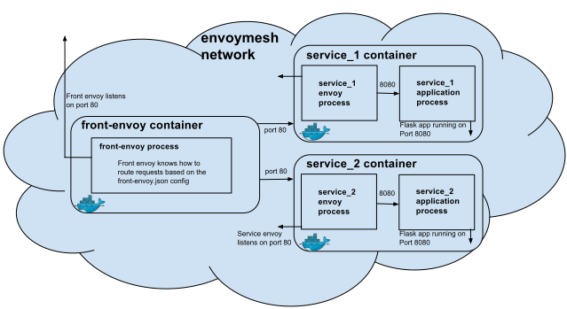

## 前端代理

为让大家尽快了解Envoy如何作为前端代理，我们发布了一个[docker compose](https://docs.docker.com/compose/)沙箱，这个沙箱部署了一个前端Envoy代理和几个后端服务（简单的空应用），并与一个正在运行的合作的Envoy服务。这三个容器将部署在名为`envoymesh`的虚拟网格中。

该Docker compose的部署图如下所示：

所有传入的请求都通过前端特使进行路由，该特使充当位于`envoymesh`网络边缘的反向代理。 端口`80`通过docker撰写映射到端口`8000`（请参阅[/examples/front-proxy/docker-compose.yml](https://github.com/envoyproxy/envoy/blob/master//examples/front-proxy/docker-compose.yml)）。 此外，请注意，由前端Envoy路由到服务容器的所有流量实际上都是路由到服务特使（在[/examples/front-proxy/front-envoy.json](https://github.com/envoyproxy/envoy/blob/master//examples/front-proxy/front-envoy.json)中设置的路由）。 反过来，服务Envoy通过环回地址（[/examples/front-proxy/service-envoy.json](https://github.com/envoyproxy/envoy/blob/master//examples/front-proxy/service-envoy.json)中的路由设置）将请求路由到烧瓶应用程序。 此设置说明了运行服务Envoy与您的服务搭配的优势：所有请求都由服务Envoy处理，并有效地路由到您的服务。

## 返回
- [上一级](../Sandboxes.md)
- [首页目录](../../README.md)