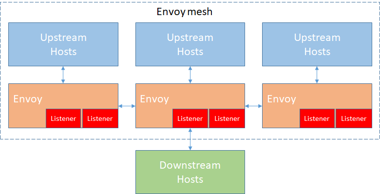

### 术语
在我们深入到主要的体系结构文档之前，需要明确一些定义。其中一些定义在行业中有些争议，在整个Envoy文档和代码库中如何使用它们的，下面就会展开。

**主机（Host）**：能够进行网络通信的实体（如手机，服务器等上的应用程序）。在这个文档中，主机是一个逻辑网络应用程序。一个物理硬件可能有多个主机上运行，只要他们可以独立寻址。

**下游（Downstream）**：下游主机连接到Envoy，发送请求并接收响应。

**上游（Upstream）**：上游主机接收来自Envoy的连接和请求并返回响应。

**监听器（Listener）**：侦听器是可以被下游客户端连接的命名网络位置（例如，端口，unix域套接字等）。Envoy公开一个或多个下游主机连接的侦听器。

**群集（Cluster）**：：群集是指Envoy连接到的一组逻辑上相似的上游主机。Envoy通过服务发现发现一个集群的成员。它可以通过主动健康检查来确定集群成员的健康度，从而Envoy通过负载均衡策略将请求路由到相应的集群成员。

**网格（Mesh）**：协调一致以提供一致的网络拓扑的一组主机。在本文档中，“Envoy mesh”是一组Envoy代理，它们构成了由多种不同服务和应用程序平台组成的分布式系统的消息传递基础。

**运行时配置（Runtime configuration）**：与Envoy一起部署的外置实时配置系统。可以更改配置设置，可以无需重启Envoy或更改主要配置。

### 返回
- [架构介绍](../Architectureoverview.md)
- [简介](../../Introduction.md)
- [首页目录](../../README.md)
